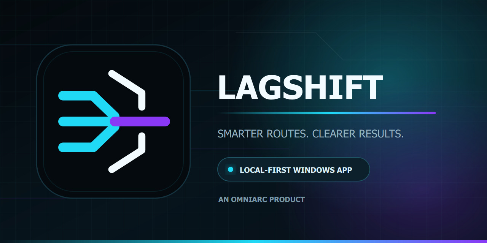

<p align="center">
  
</p>

# LAGSHIFT

**LAGSHIFT by [OMNIARC](https://github.com/OmniArcLabs)**

[](https://github.com/OmniArcLabs/LAGSHIFT/releases/latest)
[](https://github.com/OmniArcLabs/LAGSHIFT/actions/workflows/ci.yml)
[](https://github.com/OmniArcLabs/LAGSHIFT/actions/workflows/codeql.yml)
[](LICENSE)

[**دانلود آخرین نسخه**](https://github.com/OmniArcLabs/LAGSHIFT/releases/latest) ·
[شروع سریع](QUICKSTART.md) ·
[بررسی اصالت دانلود](VERIFY_DOWNLOAD.md) ·
[وضعیت اعتبارسنجی](docs/RELEASE_CHECKLIST.md) ·
[گزارش مشکل](https://github.com/OmniArcLabs/LAGSHIFT/issues/new/choose)

LAGSHIFT یک ابزار ویندوزی برای اندازه‌گیری و بهینه‌سازی اتصال بازی‌های آنلاین است.
نسخه عمومی VPN عمومی، فروشنده سرور یا ابزار عبور همه ترافیک سیستم نیست.

## امکانات نسخه عمومی 1.0

- انتخاب هوشمند DNS بر اساس پاسخ واقعی، نوسان، پایداری و هدف کاربر
- تفکیک DNSهای رفع محدودیت بازی از DNSهای عمومی سریع
- تغییر سرور و آزمایش مجدد بدون نیاز به خروج از برنامه
- تشخیص محلی اجرای بازی و جمع‌کردن وضعیت نشست پس از بسته‌شدن آن
- مشاهده مقصدهای واقعی دیده‌شده در ترافیک بازی یا Steam Relay
- Ping Matrix برای ICMP، TCP و UDP با نمایش صادقانه نتایج غیرقطعی
- Game Score، تاریخچه کیفیت، AIR Lite و Route Recipe محلی
- QoS اختیاری بازی و بازگشت خودکار تغییرات نشست
- WARP رسمی به‌صورت آزمایشی؛ فقط در صورت نصب کلاینت رسمی و تأیید واقعی مسیر
- AppRoute رایگان برای ۲۰ برنامه: خط پایه مستقیم، رقابت DNS، تأیید TLS و
  WARP رسمی اختیاری با بازگردانی خودکار
- پروفایل‌های مجزای ورود، API و دانلود برای لانچرها، ابزارهای توسعه، درایورها،
  رسانه و سرویس‌های AI؛ همراه با جست‌وجو، فیلتر و آیکون برداری
- یادگیری محلی روش موفق هر برنامه بدون ذخیره نام شبکه و کاتالوگ راه دور
  Fail-closed که فقط با امضای Ed25519 پذیرفته می‌شود
- گزارش پشتیبانی پاک‌سازی‌شده و رادار کیفیت کاملاً اختیاری
- آپدیت Fail-closed با امضای Ed25519، SHA-256 و بررسی امضای ناشر ویندوز
- رابط اصلی بدون دسترسی Administrator؛ درخواست UAC فقط برای عملیات محدود شبکه
- RouteDNA محلی با حافظهٔ زمان‌کاه، تشخیص تغییر مسیر، پایش چندنمونه‌ای، سقف مصرف،
  تشخیص Wi-Fi/کابل/همراه و Explain My Route؛ اطلاعات اپراتور فقط با رضایت جداگانه

نسخه عمومی امکان ورود کانفیگ، Subscription یا اتصال سراسری دلخواه را ارائه نمی‌کند.
کد مسیرهای توسعه‌دهنده در نسخه عمومی از رابط خارج و در زمان اجرا مسدود است.

## اجرا برای توسعه

```powershell
python -m pip install -r requirements.txt
python main.py
```

## آزمون و ساخت نسخه

```powershell
python -m unittest discover -s tests -v
powershell -ExecutionPolicy Bypass -File .\build.ps1
```

خروجی انتشار فقط در `E:\LAGSHIFT-Builds\public-rc` ساخته می‌شود.

آزمون‌های زنده و برگشت‌پذیر انتشار در `tools/qa_warp_live.py`،
`tools/qa_dns_catalog.py` و `tools/qa_release_matrix.ps1` قرار دارند. نتیجهٔ
WARP و DNS وابسته به اپراتور است و نباید بدون گزارش تاریخ‌دار به همه کاربران
تعمیم داده شود.

## کنترل‌پلین اختیاری

نمونهٔ قابل استقرار Cloudflare Worker در `backend/cloudflare-worker` قرار دارد
و Bootstrap کوتاه‌عمر، رادار ناشناسِ خاموش به‌صورت پیش‌فرض، و ارائهٔ مانیفست‌های
امضاشده از KV را پوشش می‌دهد. این بخش Relay ترافیک بازی نیست و Endpoint سلامت
نیز صریحاً `relay: false` برمی‌گرداند. کلیدهای خصوصی Ed25519 باید آفلاین و خارج
از مخزن نگهداری شوند؛ ابزارهای امضا در `tools` فقط کلید را از متغیر محیطی می‌خوانند.
همین Worker پاسخ بدون IP برای منطقه/ASN و دانلود کنترل‌شدهٔ 512KiB، 3MiB و 4MiB
را هم فراهم می‌کند. تا وقتی URL تولیدی تنظیم نشده باشد، کلاینت این دو قابلیت را
صادقانه «در دسترس نیست» گزارش می‌کند و اتصال عادی ادامه می‌یابد.

## داده و حریم خصوصی

تنظیمات در `%APPDATA%\LAGSHIFT` و داده‌های موقت در
`%LOCALAPPDATA%\LAGSHIFT` نگهداری می‌شوند. مهاجرت داده قدیمی غیرتخریبی است.
رادار ناشناس به‌صورت پیش‌فرض خاموش است و آدرس IP یا مقصد بازی را ارسال نمی‌کند.
تاریخچه AppRoute نیز فقط شناسه هش‌شده شبکه، روش اتصال و نتیجه فنی را نگه
می‌دارد و محتوای TLS، نام کاربری، رمز یا داده ورود را مشاهده نمی‌کند.

## انتشار و مجوز

کد این مخزن تحت Mozilla Public License 2.0 است. توزیع فایل اجرایی باید همراه
اطلاعات دسترسی به Source Code متناظر و اعلان‌های اجزای ثالث باشد. جزئیات در
`LICENSE` و `THIRD_PARTY_NOTICES.md` آمده است.

از نسخهٔ 1.0.1 کانال‌های Stable و Beta هنگام شروع برنامه در پس‌زمینه بررسی
می‌شوند. مانیفست انتشار با Ed25519، فایل با SHA-256 و اندازهٔ اعلام‌شده کنترل
می‌شود و دانلود قطع‌شده قابل ادامه است. فایل‌های 1.0.3 هنوز گواهی پولی
Authenticode ندارند؛ بنابراین قبل از اجرا، برنامه این محدودیت را واضح نشان
می‌دهد و تأیید صریح کاربر را می‌گیرد. نبود امضای ویندوز به معنی تأیید امنیت فایل
نیست و دانلود دستی نیز باید با `SHA256SUMS.txt` تطبیق داده شود.
- سپر امنیت با بررسی سریع/کامل کاتالوگ SHA-256، وضعیت امضای ناشر، اعتماد آپدیت و بازیابی DNS
- بازیابی اضطراری یک‌مرحله‌ای DNS، QoS متعلق به LAGSHIFT و WARP روشن‌شده توسط برنامه
- آپدیت Resume‌پذیر با کانال‌های جدا و امضاشده Stable/Beta و Match Lock

اسناد انتشار در `PRIVACY.md`، `SECURITY.md`، `QUICKSTART.md`،
`RELEASE_NOTES.md`، `CHANGELOG.md` و `SBOM.cdx.json` نگهداری و همراه Build
بسته‌بندی می‌شوند. برنامهٔ توسعهٔ عمومی در [`ROADMAP.md`](ROADMAP.md) قرار دارد.

## راستی‌آزمایی دانلود رسمی

فایل را فقط از بخش Releases همین مخزن دریافت کنید. سپس طبق
[`VERIFY_DOWNLOAD.md`](VERIFY_DOWNLOAD.md) هش SHA-256 آن را با
[`SHA256SUMS.txt`](SHA256SUMS.txt) مقایسه کنید. تغییر حتی یک بایت، هش را عوض
می‌کند. هش تطبیق‌یافته اصالت صفحهٔ دانلود را جایگزین نمی‌کند؛ هر دو باید بررسی شوند.
